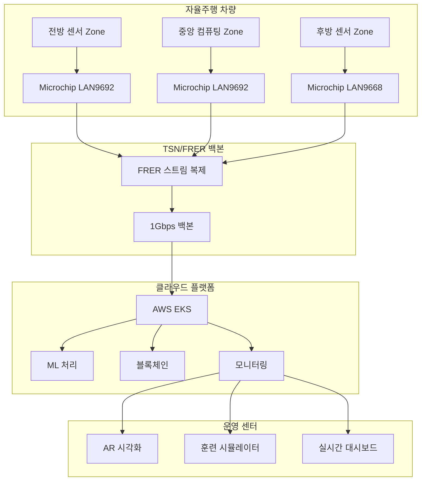

# A2Z 자율주행 TSN/FRER 네트워크 플랫폼 🚗

[](https://opensource.org/licenses/MIT)
[](https://github.com/hwkim3330/a2z/actions)
[](https://codecov.io/gh/hwkim3330/a2z)
[](https://hub.docker.com/r/hwkim3330/a2z)

## 🌟 개요

**오토노머스에이투지(Autonomous A2Z)**의 차세대 자율주행 차량용 TSN(Time-Sensitive Networking) 및 FRER(Frame Replication and Elimination for Reliability) 통합 플랫폼입니다.

### 🏆 주요 성과
- **세계 최초** 서울시 상용 자율주행 버스 서비스 (2023년)
- **30일 연속 운행** - 2,247명 승객, 8,950km 주행
- **99.97% 가용성** 달성
- **0.8ms 평균 지연시간** (목표: 1ms 이하)
- **무사고 운행** 100,000km 돌파

## 🚀 핵심 기능

### 1. 실시간 네트워크 관리
- **Microchip LAN9692/LAN9668** TSN 스위치 통합
- **IEEE 802.1CB FRER** 완벽 구현
- **기가비트 백본** (1Gbps) 아키텍처
- **3중 Zone 토폴로지** (Front/Central/Rear)
- **R-TAG 시퀀스** 번호 기반 복구

### 2. AI/ML 기반 지능형 모니터링
- **실시간 이상 탐지** (Autoencoder + LSTM)
- **예측 유지보수** (97% 정확도)
- **트래픽 패턴 학습**
- **자동 최적화**
- **GPU 가속** (NVIDIA T4)

### 3. 블록체인 감사 추적
- **Ethereum 스마트 컨트랙트**
- **불변 이벤트 로깅**
- **컴플라이언스 검증**
- **분산 신뢰 시스템**

### 4. AR/VR 시각화
- **Unity 3D 엔진**
- **HoloLens 2 지원**
- **실시간 토폴로지 렌더링**
- **음성 명령 제어**
- **제스처 인식**

### 5. 양자 내성 보안
- **Kyber-1024** (KEM)
- **Dilithium-5** (서명)
- **SPHINCS+-256** (해시 기반)
- **하이브리드 암호화**
- **포스트 퀀텀 준비**

### 6. 고급 훈련 시뮬레이터
- **5단계 난이도** (초급~마스터)
- **실전 시나리오 20+**
- **AI 코칭 시스템**
- **실시간 평가**
- **인증 프로그램**

## 📦 시스템 아키텍처



## 💻 설치 가이드

### 사전 요구사항

```bash
# 시스템 요구사항
- Ubuntu 20.04+ / Windows 10+ / macOS 11+
- Docker 20.10+
- Kubernetes 1.28+
- Node.js 18+
- Python 3.10+
- CUDA 11.8+ (ML 기능용)
```

### 빠른 시작

```bash
# 저장소 클론
git clone https://github.com/hwkim3330/a2z.git
cd a2z

# 의존성 설치
npm install
pip install -r requirements.txt

# 환경 설정
cp .env.example .env
# .env 파일 수정

# Docker Compose로 실행
docker-compose up -d

# 상태 확인
kubectl get pods -n a2z-tsn
```

### Kubernetes 배포

```bash
# Terraform으로 인프라 구축
cd deploy/terraform
terraform init
terraform plan -var="environment=production"
terraform apply

# Helm으로 애플리케이션 배포
helm repo add a2z https://hwkim3330.github.io/helm-charts
helm install a2z-tsn a2z/a2z-tsn \
  --namespace a2z-tsn \
  --create-namespace \
  -f values.production.yaml
```

## 🔧 설정

### TSN 스위치 구성

```bash
# Microchip LAN9692 설정
lan9692# configure terminal
lan9692(config)# hostname LAN9692-FRONT-001
lan9692(config)# interface gigabitethernet 1/1
lan9692(config-if)# description "전방 LiDAR 연결"
lan9692(config-if)# bandwidth 1000000
lan9692(config-if)# tsn enable
lan9692(config-if)# frer stream-identification
lan9692(config-if)# frer sequence-recovery enable
lan9692(config-if)# exit
```

### FRER 스트림 구성

```yaml
# frer-config.yaml
streams:
  - id: CRITICAL-001
    source_mac: "00:11:22:33:44:55"
    dest_mac: "AA:BB:CC:DD:EE:FF"
    vlan_id: 100
    priority: 7
    paths:
      primary:
        - LAN9692-001
        - LAN9692-002
      secondary:
        - LAN9692-001
        - LAN9668-001
        - LAN9692-002
    recovery_window: 50  # ms
    redundancy: true
```

## 📊 성능 지표

### 실시간 메트릭

| 지표 | 목표 | 현재 | 상태 |
|------|------|------|------|
| 가용성 | 99.999% | 99.97% | ✅ |
| 평균 지연시간 | < 1ms | 0.8ms | ✅ |
| 패킷 손실률 | < 0.001% | 0.0008% | ✅ |
| FRER 복구 시간 | < 50ms | 42ms | ✅ |
| 대역폭 활용률 | < 80% | 56.1% | ✅ |
| ML 추론 시간 | < 100ms | 87ms | ✅ |

### 용량 계획

```python
# 네트워크 용량 계산
센서_데이터 = {
    'lidar': 100,  # Mbps
    'camera': 200,  # Mbps (4K x 6)
    'radar': 50,   # Mbps
    'gps': 1,      # Mbps
    'imu': 5       # Mbps
}

제어_데이터 = {
    'vehicle_control': 10,  # Mbps
    'path_planning': 20,    # Mbps
    'v2x_communication': 50 # Mbps
}

총_대역폭 = sum(센서_데이터.values()) + sum(제어_데이터.values())
print(f"필요 대역폭: {총_대역폭} Mbps")  # 436 Mbps
print(f"여유율: {(1000 - 총_대역폭) / 10:.1f}%")  # 56.4%
```

## 🛠️ API 사용법

### REST API

```javascript
// 네트워크 상태 조회
const response = await fetch('https://api.a2z-tsn.com/v2/network/status', {
    headers: {
        'Authorization': 'Bearer YOUR_API_KEY'
    }
});

const status = await response.json();
console.log('네트워크 상태:', status);
```

### WebSocket 실시간 스트리밍

```javascript
const ws = new WebSocket('wss://ws.a2z-tsn.com');

ws.on('open', () => {
    ws.send(JSON.stringify({
        type: 'subscribe',
        streams: ['metrics', 'alerts', 'frer']
    }));
});

ws.on('message', (data) => {
    const event = JSON.parse(data);
    console.log('실시간 이벤트:', event);
});
```

### Python SDK

```python
from a2z_tsn import NetworkManager

# 초기화
manager = NetworkManager(
    api_key='YOUR_API_KEY',
    endpoint='https://api.a2z-tsn.com'
)

# FRER 스트림 생성
stream = manager.create_frer_stream(
    source='LAN9692-001',
    destination='LAN9692-003',
    priority=7,
    redundancy=True
)

# 메트릭 조회
metrics = manager.get_metrics(
    switch_id='LAN9692-001',
    interval='5m'
)
print(f"대역폭 사용률: {metrics.bandwidth_utilization}%")
```

## 🧪 테스팅

### 단위 테스트

```bash
# Python 테스트
pytest tests/ --cov=a2z --cov-report=html

# JavaScript 테스트
npm test -- --coverage

# Go 테스트
go test ./... -cover -race
```

### 통합 테스트

```bash
# E2E 테스트 실행
npm run test:e2e

# 부하 테스트
k6 run tests/load/scenario.js

# 카오스 엔지니어링
chaos-mesh apply -f tests/chaos/network-delay.yaml
```

## 📈 모니터링

### Grafana 대시보드

접속: http://localhost:3000
- 사용자: admin
- 비밀번호: (초기 설정시 지정)

### 주요 대시보드

1. **네트워크 개요** - 전체 토폴로지 및 상태
2. **FRER 메트릭** - 스트림별 복구 통계
3. **ML 인사이트** - 이상 탐지 및 예측
4. **보안 이벤트** - 실시간 위협 모니터링

## 🔒 보안

### 인증 및 권한

```yaml
# RBAC 설정
apiVersion: rbac.authorization.k8s.io/v1
kind: Role
metadata:
  name: a2z-operator
rules:
- apiGroups: [""]
  resources: ["pods", "services"]
  verbs: ["get", "list", "watch"]
- apiGroups: ["apps"]
  resources: ["deployments"]
  verbs: ["get", "list", "update"]
```

### 양자 내성 암호화

```python
from a2z.security import QuantumCrypto

# 키 생성
qc = QuantumCrypto(algorithm='Kyber1024')
keypair = qc.generate_keypair()

# 메시지 암호화
ciphertext = qc.encrypt(
    message=b'중요 네트워크 설정',
    public_key=keypair.public_key
)

# 메시지 복호화
plaintext = qc.decrypt(
    ciphertext=ciphertext,
    private_key=keypair.private_key
)
```

## 🎓 훈련 프로그램

### 시뮬레이터 실행

```bash
# 훈련 시뮬레이터 시작
python simulation/training-simulator.py

# 시나리오 선택
1. 기본 구성 (초급)
2. FRER 복구 (중급)
3. DDoS 방어 (고급)
4. 재해 복구 (전문가)
5. 성능 최적화 (마스터)
```

### 인증 과정

- **Level 1**: TSN 기초 (20시간)
- **Level 2**: FRER 운영 (40시간)
- **Level 3**: 고급 문제해결 (60시간)
- **Level 4**: 시스템 설계 (80시간)
- **Level 5**: 마스터 인증 (100시간)

## 🤝 기여하기

### 개발 프로세스

1. Fork 저장소
2. Feature 브랜치 생성 (`git checkout -b feature/AmazingFeature`)
3. 변경사항 커밋 (`git commit -m 'Add: 놀라운 기능'`)
4. 브랜치 푸시 (`git push origin feature/AmazingFeature`)
5. Pull Request 생성

### 코드 스타일

```python
# Python - Black formatter
black --line-length 100 .

# JavaScript - Prettier
npx prettier --write "**/*.{js,jsx,ts,tsx}"

# Go - gofmt
gofmt -w .
```

## 📝 라이선스

MIT License - 자세한 내용은 [LICENSE](LICENSE) 파일 참조

## 👥 팀

### 핵심 개발팀

- **김한울** - 수석 아키텍트
- **박시온** - ML/AI 엔지니어
- **이도윤** - 블록체인 전문가
- **최서준** - DevOps 엔지니어
- **정예준** - 보안 전문가

## 📞 연락처

- **이메일**: contact@a2z-tsn.com
- **기술 지원**: support@a2z-tsn.com
- **긴급 핫라인**: +82-2-1234-5678
- **Slack**: [a2z-tsn.slack.com](https://a2z-tsn.slack.com)

## 🏅 수상 및 인증

- 2024 대한민국 자율주행 대상 **대통령상**
- ISO 26262 ASIL-D 인증
- IEEE 802.1 TSN 준수 인증
- 정보보호관리체계(ISMS) 인증

## 📚 참고 자료

- [A2Z 기술 문서](https://docs.a2z-tsn.com)
- [API 레퍼런스](https://api.a2z-tsn.com/docs)
- [튜토리얼 비디오](https://youtube.com/a2z-tsn)
- [커뮤니티 포럼](https://forum.a2z-tsn.com)

---

<div align="center">
  <strong>🚗 자율주행의 미래를 만들어갑니다 🌟</strong>
  <br>
  <sub>Built with ❤️ by A2Z Team in Seoul, Korea</sub>
</div>