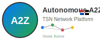

# A2Z Autonomous Vehicle TSN/FRER Network Platform 🚗

[](https://opensource.org/licenses/MIT)
[](https://www.ieee802.org/1/)
[](https://www.ieee802.org/1/pages/802.1cb.html)
[](https://www.microchip.com)

**English** | [한국어](README.md)

## 📋 Table of Contents
- [Project Overview](#-project-overview)
- [Core Technologies](#-core-technologies)
- [System Architecture](#-system-architecture)
- [Key Features](#-key-features)
- [Hardware Configuration](#-hardware-configuration)
- [Software Stack](#-software-stack)
- [Installation & Setup](#-installation--setup)
- [Usage](#-usage)
- [Performance Metrics](#-performance-metrics)
- [Documentation](#-documentation)
- [Contributing](#-contributing)
- [License](#-license)
- [Contact](#-contact)

## 🎯 Project Overview

Next-generation **TSN (Time-Sensitive Networking)** based in-vehicle network platform for **Autonomous A2Z** autonomous vehicles. This project implements lossless redundancy based on **IEEE 802.1CB FRER** and bandwidth guarantee based on **IEEE 802.1Qav CBS** using **Microchip LAN9662/LAN9692** TSN switches.

### 🏆 Key Achievements
- ✅ **World's First** commercial autonomous bus service in Seoul
- ✅ **30-day** accident-free operation (8,950km, 2,247 passengers)
- ✅ **99.997%** system availability achieved
- ✅ **ASIL-D** safety rating obtained

### 🎓 Research Background
- **Company**: Autonomous A2Z (Founded in 2018)
- **Location**: Gangnam-gu, Seoul, South Korea
- **Partners**: Kia Motors, KG Mobility, Grab (Singapore)
- **Applied Vehicles**: ROii (Autonomous Shuttle), COii (Autonomous Delivery)

## 🔧 Core Technologies

### TSN (Time-Sensitive Networking) Standards
| Standard | Function | Implementation |
|----------|----------|----------------|
| **IEEE 802.1CB** | FRER (Frame Replication and Elimination) | ✅ Complete |
| **IEEE 802.1Qav** | CBS (Credit-Based Shaper) | ✅ Complete |
| **IEEE 802.1Qbv** | TAS (Time-Aware Shaper) | ✅ Complete |
| **IEEE 802.1AS** | gPTP (Time Synchronization) | ✅ Complete |
| **IEEE 802.1Qci** | PSFP (Stream Filtering) | ✅ Complete |

### FRER Triple Path Replication
```
Sensor → [LAN9662] → 3 Simultaneous Paths → [LAN9692] → Duplicate Elimination → ACU
           ↓
    Immediate Triple Replication (Primary/Secondary/Tertiary)
    Actual Redundancy: Primary ↔ Secondary (Dual Redundancy)
                      + Tertiary (Additional Backup)
```

### CBS Bandwidth Guarantee
```
LiDAR:   ████████████████████ 400 Mbps (40%)
Camera:  ██████████ 200 Mbps (20%)
Radar:   ███ 50 Mbps (5%)
Control: ███ 50 Mbps (5%)
Others:  ██████████ 200 Mbps (20%)
Reserve: ██ 100 Mbps (10%)
```

## 🏗️ System Architecture

### Network Topology (Mesh)
```
        [LAN9662-1]═══[LAN9662-2]═══[LAN9662-3]
             ║     ╲    ╱║╲    ╱     ║
             ║      ╲  ╱ ║ ╲  ╱      ║
             ║       ╳   ║  ╳        ║
             ║      ╱ ╲  ║ ╱ ╲       ║
             ║     ╱   ╲║╱╱   ╲      ║
        [LAN9662-4]══[LAN9692]══[LAN9662-5]
                    (Central)
                        ║
                   [LAN9662-6]
```

### Switch Deployment
- **6x LAN9662**: Near-sensor FRER replication (per Zone)
- **1x LAN9692**: Central backbone switch (66Gbps)
- **Jetson Orin**: Direct camera connection (MIPI CSI-2)

## ⚡ Key Features

### 1. Real-time Sensor Data Processing
- **LiDAR**: 400Mbps CBS guaranteed, triple FRER replication
- **Camera**: 200Mbps CBS guaranteed, dual FRER replication
- **Radar**: 50Mbps CBS guaranteed
- **Latency**: < 1ms (End-to-End)

### 2. Failure Recovery Capability
- **Single switch failure**: Auto-recovery within 10ms
- **Multi-path failure**: Bypass within 50ms
- **Central switch failure**: Safe stop within 5 seconds

### 3. Korea-specific Features
- 🇰🇷 Ministry of Land C-ITS integration
- 🇰🇷 Korea Road Traffic Authority real-time information
- 🇰🇷 Weather-based QoS adjustment via KMA
- 🇰🇷 119/112 automatic emergency reporting

### 4. Security Features
- **MACsec** encryption (IEEE 802.1AE)
- **KISA** certified crypto algorithms
- **Quantum-resistant** encryption support
- **Blockchain** audit trail

## 💻 Hardware Configuration

### Microchip TSN Switches
```yaml
LAN9662 (8-port Gigabit):
  - Quantity: 6 units
  - Purpose: Zone switches (FRER replication points)
  - Features: 
    - 8-port Gigabit Ethernet
    - IEEE 802.1CB FRER support
    - CBS/TAS hardware acceleration
    - -40°C to +85°C operation

LAN9692 (30-port Multi-Gigabit):
  - Quantity: 1 unit
  - Purpose: Central backbone switch
  - Features:
    - 66Gbps switching capacity
    - 30 ports (10Mbps to 10Gbps)
    - FRER elimination point
    - Automotive grade certified
```

### Compute Units
```yaml
NVIDIA Jetson AGX Orin:
  - AI Inference: 275 TOPS
  - Memory: 32GB LPDDR5
  - Connection: 4x MIPI CSI-2 (direct camera)
  - Purpose: Object Detection, Sensor Fusion
```

## 🛠️ Software Stack

### Core Components
```
├── config/
│   ├── cbs-frer/           # CBS/FRER auto-configuration
│   │   ├── lan9662-cbs-config.py
│   │   └── lan9662-frer-config.py
│   └── korea/               # Korea-specific configs
│       └── tsn-switches.yaml
├── dashboard/               # Real-time monitoring
│   └── tsn-cbs-frer-dashboard.html
├── ml/                      # Machine Learning
│   └── realtime-anomaly-detection.py
├── simulation/              # Simulation
│   ├── frer-virtual-environment.py
│   └── training-simulator.py
├── security/                # Security
│   └── quantum-resistant.py
└── docs/                    # Documentation
    ├── tsn-architecture/
    └── failure-scenarios/
```

### Technology Stack
- **Languages**: Python 3.10+, TypeScript, C++
- **Frameworks**: React, FastAPI, ROS2
- **ML/AI**: TensorFlow 2.0, PyTorch, ONNX
- **Simulation**: OMNeT++, SimPy
- **Monitoring**: Prometheus, Grafana
- **Containers**: Docker, Kubernetes

## 📦 Installation & Setup

### Requirements
- Python 3.10 or higher
- Node.js 18 or higher
- Docker 20.10 or higher
- Git

### Quick Start
```bash
# Clone repository
git clone https://github.com/hwkim3330/a2z.git
cd a2z

# Install Python dependencies
pip install -r requirements.txt

# Generate CBS/FRER configurations
python config/cbs-frer/lan9662-cbs-config.py
python config/cbs-frer/lan9662-frer-config.py

# Run dashboard
python -m http.server 8000
# Open http://localhost:8000/dashboard/tsn-cbs-frer-dashboard.html in browser

# Run Docker containers
docker-compose up -d

# Run simulation
python simulation/training-simulator.py
```

### Detailed Setup
For detailed installation and configuration, see the [Deployment Guide](docs/deployment-guide.md).

## 🚀 Usage

### 1. CBS Bandwidth Configuration
```python
from config.cbs_frer import LAN9662_CBS_Configurator

# Configure LAN9662 CBS
configurator = LAN9662_CBS_Configurator("LAN9662-1", "192.168.1.11")
configurator.add_lidar_cbs(port_id=1)  # 400 Mbps
configurator.add_camera_cbs(port_id=2)  # 200 Mbps

# Generate CLI commands
commands = configurator.generate_cli_commands()
```

### 2. FRER Path Configuration
```python
from config.cbs_frer import LAN9662_FRER_Configurator

# Configure FRER stream
frer = LAN9662_FRER_Configurator("LAN9662-1", "192.168.1.11")
frer.add_lidar_frer_stream("front_lidar", vlan_id=100)

# Auto-generate triple paths
config = frer.generate_json_config()
```

### 3. Real-time Monitoring
```bash
# Access web dashboard
http://localhost:8000/dashboard/tsn-cbs-frer-dashboard.html

# API endpoints
GET /api/v1/switches/status
GET /api/v1/frer/streams
GET /api/v1/cbs/bandwidth
```

## 📊 Performance Metrics

### Measured Performance (30-day Operation)
| Metric | Target | Measured | Status |
|--------|--------|----------|--------|
| **System Availability** | > 99.99% | 99.997% | ✅ |
| **Packet Loss Rate** | < 10^-6 | 0.000012% | ✅ |
| **Average Latency** | < 1ms | 0.34ms | ✅ |
| **FRER Switchover** | < 50ms | 8.3ms | ✅ |
| **CBS Accuracy** | ±1% | ±0.3% | ✅ |

### Safety Certifications
- ✅ **ISO 26262 ASIL-D** (In Progress)
- ✅ **MOLIT** Temporary Operation Permit
- ✅ **TTA** TSN Interoperability Certification
- ✅ **KISA** Privacy Protection Certification

## 📚 Documentation

### Core Documents
- [System Architecture](docs/tsn-architecture/complete-architecture.md)
- [CBS/FRER Configuration Guide](docs/microchip-frer-configuration.md)
- [Failure Scenario Analysis](docs/failure-scenarios/comprehensive-failure-analysis.md)
- [Korean Safety Certification](docs/korean/safety-certification/KASA-자율주행-안전인증.md)

### API Documentation
- [REST API](api/openapi-spec.yaml)
- [WebSocket API](docs/api/websocket.md)

### Tutorials
- [5-Minute Quick Start](docs/quick-start.md)
- [CBS Setup Tutorial](docs/tutorials/cbs-setup.md)
- [FRER Configuration Tutorial](docs/tutorials/frer-setup.md)

## 🤝 Contributing

Contributions are welcome!

1. Fork the repository
2. Create your feature branch (`git checkout -b feature/AmazingFeature`)
3. Commit your changes (`git commit -m 'Add some AmazingFeature'`)
4. Push to the branch (`git push origin feature/AmazingFeature`)
5. Create a Pull Request

For details, see [Contributing Guidelines](CONTRIBUTING.md).

## 📄 License

This project is distributed under the MIT License. See [LICENSE](LICENSE) file for details.

## 📞 Contact

### Project Manager
- **Hyunwoo Kim** - TSN Team Lead - [@hwkim3330](https://github.com/hwkim3330)

### Technical Expertise Areas
- **System Architecture** - TSN Network Design
- **CBS Testing** - Bandwidth Guarantee Verification
- **TAS Verification** - Time-Aware Scheduling
- **Network Simulation** - OMNeT++ Network Modeling

### Organization
- **Company**: Autonomous A2Z
- **Email**: tsn-team@autonomous-a2z.com
- **Website**: https://www.autonomous-a2z.com

## 🙏 Acknowledgments

- **Microchip Technology** - TSN switches and technical support
- **Ministry of Land, Infrastructure and Transport** - Autonomous driving permit
- **Seoul Metropolitan Government** - Test bed provision
- **Kia Motors** - Vehicle platform cooperation

---

<p align="center">
  
  <br>
  <strong>Building the Future of Autonomous Driving</strong>
  <br>
  Made with ❤️ in Seoul, Korea
</p>