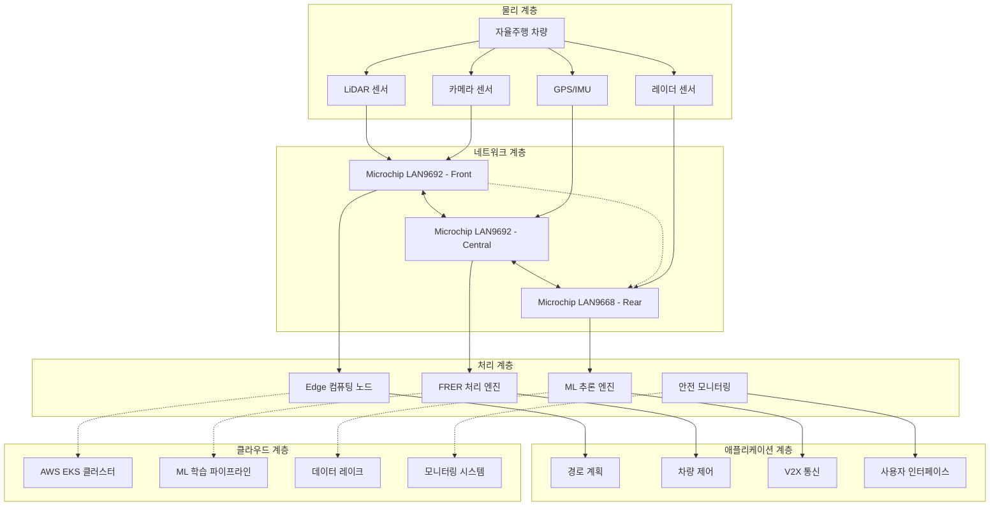

# A2Z 시스템 아키텍처 문서

## 📋 목차

1. [개요](#개요)
2. [전체 아키텍처](#전체-아키텍처)
3. [네트워크 계층](#네트워크-계층)
4. [애플리케이션 계층](#애플리케이션-계층)
5. [데이터 플로우](#데이터-플로우)
6. [보안 아키텍처](#보안-아키텍처)
7. [클라우드 인프라](#클라우드-인프라)
8. [확장성 설계](#확장성-설계)

## 개요

A2Z 자율주행 TSN/FRER 시스템은 차세대 자율주행 차량을 위한 고성능, 고신뢰성 네트워크 플랫폼입니다.

### 핵심 설계 원칙

- **결정론적 통신**: IEEE 802.1 TSN 표준 준수
- **무중단 서비스**: 99.999% 가용성 목표
- **실시간 처리**: 1ms 이하 지연시간
- **확장 가능한 구조**: 마이크로서비스 아키텍처
- **보안 우선**: 다층 보안 체계

## 전체 아키텍처



## 네트워크 계층

### TSN 스위치 배치

#### 전방 Zone (Front Zone)
```yaml
스위치: Microchip LAN9692-001
위치: 전방 센서 허브
연결 센서:
  - LiDAR (4개): 100Mbps each
  - 카메라 (6개): 200Mbps each
  - 레이더 (2개): 50Mbps each
포트 구성:
  - 기가비트 포트: 30개
  - 관리 포트: 2개
  - 업링크: 2 x 1Gbps
```

#### 중앙 Zone (Central Zone)
```yaml
스위치: Microchip LAN9692-002
위치: 메인 컴퓨팅 유닛
연결 장치:
  - 메인 ECU
  - GPU 컴퓨팅 노드
  - V2X 모듈
  - 차량 제어 시스템
기능:
  - FRER 스트림 관리
  - QoS 정책 적용
  - 트래픽 셰이핑
```

#### 후방 Zone (Rear Zone)
```yaml
스위치: Microchip LAN9668-001
위치: 후방 센서 허브
연결 센서:
  - 후방 카메라 (3개)
  - 후방 레이더 (3개)
  - 주차 센서 (8개)
포트 구성:
  - 기가비트 포트: 8개
  - 관리 포트: 1개
```

### FRER 구성

#### 중요 스트림 (Critical Streams)
```python
critical_streams = {
    "BRAKE_CONTROL": {
        "priority": 7,  # 최고 우선순위
        "latency_budget": "0.5ms",
        "redundancy": "dual_path",
        "recovery_window": "10ms"
    },
    "STEERING_CONTROL": {
        "priority": 7,
        "latency_budget": "1ms",
        "redundancy": "dual_path",
        "recovery_window": "15ms"
    },
    "LIDAR_DATA": {
        "priority": 6,
        "latency_budget": "5ms",
        "redundancy": "single_path",
        "bandwidth": "100Mbps"
    }
}
```

## 애플리케이션 계층

### 마이크로서비스 구조

```yaml
services:
  network-manager:
    description: "TSN/FRER 네트워크 관리"
    replicas: 3
    resources:
      cpu: "500m"
      memory: "1Gi"
    ports:
      - 3000  # REST API
      - 8080  # WebSocket
    
  ml-engine:
    description: "실시간 ML 추론"
    replicas: 2
    resources:
      cpu: "2000m"
      memory: "4Gi"
      gpu: "1"  # NVIDIA T4
    
  blockchain-audit:
    description: "블록체인 감사 추적"
    replicas: 2
    resources:
      cpu: "500m"
      memory: "2Gi"
    
  frer-processor:
    description: "FRER 스트림 처리"
    replicas: 3
    resources:
      cpu: "1000m"
      memory: "2Gi"
```

### API 게이트웨이

```nginx
# nginx.conf
upstream a2z_backend {
    server network-manager:3000 weight=3;
    server network-manager:3001 weight=2;
    server network-manager:3002 weight=1;
}

server {
    listen 80;
    server_name api.a2z-tsn.com;
    
    location /v2/network {
        proxy_pass http://a2z_backend;
        proxy_set_header X-Real-IP $remote_addr;
        proxy_set_header X-Forwarded-For $proxy_add_x_forwarded_for;
        proxy_set_header Host $http_host;
        
        # TSN 특화 헤더
        proxy_set_header X-TSN-Priority $arg_priority;
        proxy_set_header X-FRER-Stream $arg_stream_id;
    }
    
    location /v2/frer {
        proxy_pass http://frer-processor:4000;
        proxy_timeout 1s;  # 실시간 처리
    }
}
```

## 데이터 플로우

### 센서 데이터 파이프라인

```python
# 데이터 플로우 정의
from dataclasses import dataclass
from typing import Dict, List
import asyncio

@dataclass
class SensorData:
    timestamp: float
    sensor_id: str
    data_type: str
    payload: bytes
    priority: int
    frer_stream_id: str = None

class DataPipeline:
    def __init__(self):
        self.processors = {
            'lidar': self.process_lidar,
            'camera': self.process_camera,
            'radar': self.process_radar
        }
    
    async def process_sensor_data(self, data: SensorData) -> Dict:
        """센서 데이터 처리 파이프라인"""
        # 1. 데이터 유효성 검증
        if not self.validate_data(data):
            raise ValueError(f"Invalid data from {data.sensor_id}")
        
        # 2. TSN 우선순위 적용
        tsn_metadata = {
            'priority': data.priority,
            'latency_budget': self.get_latency_budget(data.data_type),
            'bandwidth_requirement': self.get_bandwidth_requirement(data.data_type)
        }
        
        # 3. FRER 스트림 할당
        if data.priority >= 6:  # 중요 데이터
            data.frer_stream_id = await self.assign_frer_stream(data)
        
        # 4. 데이터 처리
        processed_data = await self.processors[data.data_type](data)
        
        # 5. ML 추론 (필요시)
        if self.requires_ml_inference(data.data_type):
            ml_result = await self.ml_inference(processed_data)
            processed_data['ml_inference'] = ml_result
        
        return {
            'original_data': data,
            'processed_data': processed_data,
            'tsn_metadata': tsn_metadata,
            'processing_time': time.time() - data.timestamp
        }
```

### 실시간 처리 아키텍처

```python
# Apache Kafka 기반 스트리밍
from kafka import KafkaProducer, KafkaConsumer
import json

class RealTimeProcessor:
    def __init__(self):
        self.producer = KafkaProducer(
            bootstrap_servers=['kafka-cluster:9092'],
            value_serializer=lambda v: json.dumps(v).encode('utf-8'),
            # TSN 특화 설정
            acks='all',
            retries=0,  # 실시간성 우선
            max_in_flight_requests_per_connection=1
        )
    
    async def process_critical_event(self, event_data):
        """중요 이벤트 실시간 처리"""
        # 1. 즉시 처리 큐로 전송
        await self.producer.send(
            'critical-events',
            key=event_data['stream_id'],
            value=event_data,
            # TSN 우선순위 헤더
            headers={
                'priority': str(event_data['priority']).encode(),
                'latency_budget': str(event_data['latency_budget']).encode()
            }
        )
        
        # 2. FRER 복구 체크
        if event_data.get('requires_frer'):
            await self.check_frer_recovery(event_data)
```

## 보안 아키텍처

### 다층 보안 모델

```yaml
security_layers:
  layer_1_physical:
    - "하드웨어 보안 모듈 (HSM)"
    - "Secure Boot"
    - "하드웨어 암호화"
    
  layer_2_network:
    - "802.1X 인증"
    - "MACsec 암호화"
    - "VLAN 분리"
    
  layer_3_transport:
    - "TLS 1.3"
    - "양자 내성 암호화"
    - "IPSec VPN"
    
  layer_4_application:
    - "JWT 토큰"
    - "OAuth 2.0"
    - "RBAC 권한 제어"
    
  layer_5_data:
    - "AES-256 암호화"
    - "키 순환"
    - "데이터 마스킹"
```

### 양자 내성 암호화 구현

```python
from security.quantum_resistant import QuantumCrypto

class SecureChannel:
    def __init__(self):
        self.qc = QuantumCrypto(algorithm='Kyber1024')
        self.session_keys = {}
    
    async def establish_secure_channel(self, peer_id: str) -> str:
        """안전한 통신 채널 수립"""
        # 1. 양자 내성 키 교환
        keypair = self.qc.generate_keypair()
        
        # 2. 키 캡슐화
        ciphertext, shared_secret = self.qc.encapsulate(
            peer_public_key=await self.get_peer_public_key(peer_id),
            algorithm='Kyber1024'
        )
        
        # 3. 세션 키 생성
        session_key = self.derive_session_key(shared_secret)
        session_id = self.generate_session_id()
        
        self.session_keys[session_id] = {
            'key': session_key,
            'peer_id': peer_id,
            'created_at': time.time(),
            'algorithm': 'ChaCha20-Poly1305'
        }
        
        return session_id
    
    def encrypt_message(self, session_id: str, message: bytes) -> bytes:
        """메시지 암호화"""
        session = self.session_keys[session_id]
        
        cipher = ChaCha20_Poly1305.new(key=session['key'])
        ciphertext, tag = cipher.encrypt_and_digest(message)
        
        return cipher.nonce + tag + ciphertext
```

## 클라우드 인프라

### AWS EKS 클러스터 구성

```hcl
# terraform/main.tf
module "eks" {
  source = "terraform-aws-modules/eks/aws"
  
  cluster_name    = "a2z-tsn-production"
  cluster_version = "1.28"
  
  # TSN 특화 노드 그룹
  eks_managed_node_groups = {
    tsn_critical = {
      name = "tsn-critical-nodes"
      
      instance_types = ["c6i.2xlarge"]  # 높은 네트워킹 성능
      min_size       = 3
      max_size       = 9
      desired_size   = 3
      
      # 실시간 처리를 위한 설정
      user_data = base64encode(templatefile(
        "${path.module}/user_data.sh",
        {
          # RT 커널 설정
          enable_rt_kernel = true,
          # CPU 격리 설정
          isolated_cpus = "2-7",
          # 네트워크 최적화
          enable_sr_iov = true
        }
      ))
      
      labels = {
        "workload-type" = "tsn-critical"
        "network-priority" = "high"
      }
      
      taints = [
        {
          key    = "tsn-critical"
          value  = "true"
          effect = "NO_SCHEDULE"
        }
      ]
    }
  }
}
```

### Helm 차트 구조

```yaml
# helm/a2z-tsn/values.yaml
global:
  domain: a2z-tsn.com
  imageRegistry: ghcr.io/hwkim3330
  
  # TSN 특화 설정
  tsn:
    priorityClassName: "tsn-critical"
    nodeAffinity:
      requiredDuringSchedulingIgnoredDuringExecution:
        nodeSelectorTerms:
        - matchExpressions:
          - key: "workload-type"
            operator: In
            values: ["tsn-critical"]
  
  # 실시간 설정
  realtime:
    cpuManager: "static"
    cpuRequests: "4"  # 전용 CPU 코어
    hugePages: "2Mi"
    
  # 보안 설정
  security:
    podSecurityPolicy: "restricted"
    networkPolicy: true
    quantumResistant: true

# 네트워크 관리자
networkManager:
  enabled: true
  replicaCount: 3
  
  image:
    repository: a2z/network-manager
    tag: "2.0.0"
    
  resources:
    requests:
      memory: "1Gi"
      cpu: "500m"
    limits:
      memory: "2Gi"
      cpu: "1000m"
  
  # TSN 특화 환경 변수
  env:
    TSN_PRIORITY_MAPPING: "7:250,6:500,5:750"
    FRER_RECOVERY_WINDOW: "50"
    MAX_LATENCY_BUDGET: "1000"
```

## 확장성 설계

### 수평적 확장

```python
# 자동 스케일링 정책
class AutoScaler:
    def __init__(self):
        self.metrics = {
            'cpu_threshold': 70,
            'memory_threshold': 80,
            'network_latency_threshold': 5,  # ms
            'frer_recovery_rate_threshold': 10  # per second
        }
    
    async def evaluate_scaling(self) -> Dict[str, int]:
        """스케일링 결정"""
        current_metrics = await self.get_current_metrics()
        scaling_decision = {}
        
        # CPU 기반 스케일링
        if current_metrics['cpu'] > self.metrics['cpu_threshold']:
            scaling_decision['network-manager'] = +1
        
        # 네트워크 지연시간 기반 스케일링
        if current_metrics['avg_latency'] > self.metrics['network_latency_threshold']:
            scaling_decision['frer-processor'] = +2
        
        # FRER 복구율 기반 스케일링
        if current_metrics['frer_recovery_rate'] > self.metrics['frer_recovery_rate_threshold']:
            scaling_decision['frer-processor'] = +1
            scaling_decision['ml-engine'] = +1
        
        return scaling_decision
```

### 지리적 분산

```yaml
# 멀티 리전 배포
regions:
  primary:
    region: "ap-northeast-2"  # 서울
    clusters:
      - "a2z-tsn-seoul-1"
      - "a2z-tsn-seoul-2"
    
  secondary:
    region: "ap-northeast-1"  # 도쿄
    clusters:
      - "a2z-tsn-tokyo-1"
    
  disaster_recovery:
    region: "us-west-2"  # 오레곤
    clusters:
      - "a2z-tsn-oregon-dr"

# 글로벌 로드 밸런싱
routing_policy:
  geolocation:
    - location: "KR"
      endpoint: "seoul.a2z-tsn.com"
    - location: "JP"
      endpoint: "tokyo.a2z-tsn.com"
    - location: "default"
      endpoint: "global.a2z-tsn.com"
  
  latency_based:
    enabled: true
    health_check_interval: 30
```

## 성능 최적화

### 네트워크 최적화

```python
# 네트워크 튜닝 파라미터
network_optimizations = {
    # TSN 특화 설정
    'tsn_time_aware_shaper': {
        'gate_control_list': [
            {'priority': 7, 'time_slot': '0-100us'},
            {'priority': 6, 'time_slot': '100-300us'},
            {'priority': 5, 'time_slot': '300-500us'}
        ]
    },
    
    # FRER 최적화
    'frer_optimization': {
        'sequence_recovery_algorithm': 'vector_recovery',
        'elimination_timeout': 50,  # microseconds
        'replication_factor': 2
    },
    
    # 커널 바이패스
    'dpdk_configuration': {
        'enabled': True,
        'pmd_cores': [2, 3, 4, 5],
        'memory_channels': 4,
        'huge_pages': '2048x2MB'
    }
}
```

### 메모리 최적화

```c
// 실시간 메모리 할당자
#include <sys/mman.h>
#include <stdlib.h>

// TSN 특화 메모리 풀
struct tsn_memory_pool {
    void *base_addr;
    size_t pool_size;
    size_t block_size;
    unsigned int free_blocks;
    unsigned char *bitmap;
};

// 실시간 메모리 할당 (락 프리)
void* rt_malloc(struct tsn_memory_pool *pool, size_t size) {
    // O(1) 시간 복잡도 보장
    unsigned int block_idx = find_free_block_atomic(pool);
    if (block_idx == INVALID_BLOCK) {
        return NULL;
    }
    
    mark_block_used_atomic(pool, block_idx);
    return pool->base_addr + (block_idx * pool->block_size);
}

// 지연시간 없는 메모리 해제
void rt_free(struct tsn_memory_pool *pool, void *ptr) {
    size_t offset = (char*)ptr - (char*)pool->base_addr;
    unsigned int block_idx = offset / pool->block_size;
    mark_block_free_atomic(pool, block_idx);
}
```

이 문서는 A2Z TSN/FRER 시스템의 상세한 아키텍처를 다룹니다. 실제 구현 시에는 각 컴포넌트의 세부 사항을 더욱 상세히 설계해야 합니다.